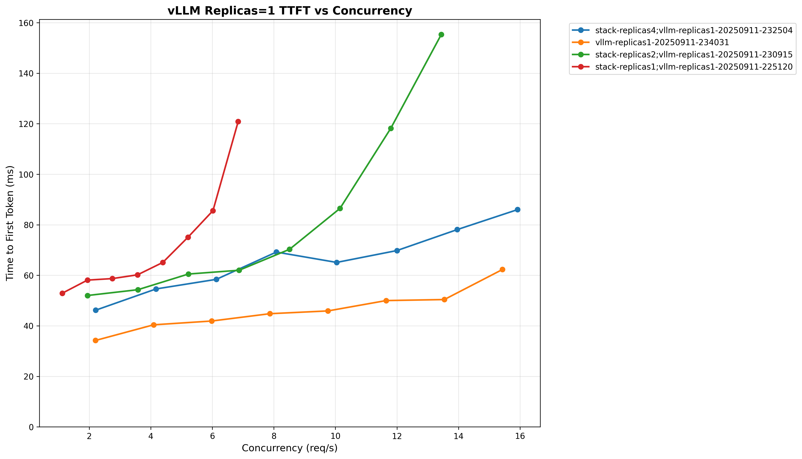
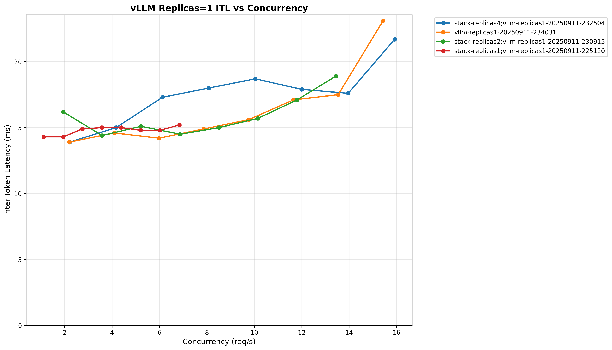
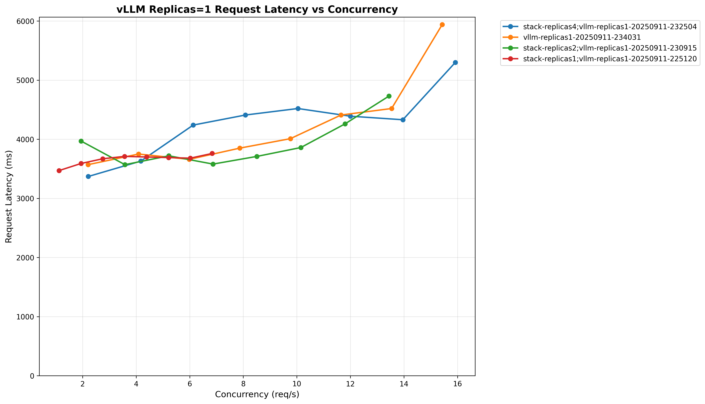

# Llama Stack Benchmark Suite on Kubernetes

## Motivation

Performance benchmarking is critical for understanding the overhead and characteristics of the Llama Stack abstraction layer compared to direct inference engines like vLLM.

### Why This Benchmark Suite Exists

**Performance Validation**: The Llama Stack provides a unified API layer across multiple inference providers, but this abstraction introduces potential overhead. This benchmark suite quantifies the performance impact by comparing:
- Llama Stack inference (with vLLM backend)
- Direct vLLM inference calls
- Both under identical Kubernetes deployment conditions

**Production Readiness Assessment**: Real-world deployments require understanding performance characteristics under load. This suite simulates concurrent user scenarios with configurable parameters (duration, concurrency, request patterns) to validate production readiness.

**Regression Detection**: As the Llama Stack evolves, this benchmark provides automated regression detection for performance changes. CI/CD pipelines can leverage these benchmarks to catch performance degradations before production deployments.

**Resource Planning**: By measuring throughput, latency percentiles, and resource utilization patterns, teams can make informed decisions about:
- Kubernetes resource allocation (CPU, memory, GPU)
- Auto-scaling configurations
- Cost optimization strategies

### Key Metrics Captured

The benchmark suite measures critical performance indicators:
- **Throughput**: Requests per second under sustained load
- **Latency Distribution**: P50, P95, P99 response times
- **Time to First Token (TTFT)**: Critical for streaming applications
- **Inter-Token Latency (ITL)**: Token generation speed for streaming
- **Error Rates**: Request failures and timeout analysis

This data enables data-driven architectural decisions and performance optimization efforts.

## Setup

**1. Deploy base k8s infrastructure:**
```bash
cd ../../docs/source/distributions/k8s
./apply.sh
```

**2. Deploy benchmark components:**
```bash
./apply.sh
```

**3. Verify deployment:**
```bash
kubectl get pods
# Should see: llama-stack-benchmark-server, vllm-server, etc.
```

## Benchmark Results

We use [GuideLLM](https://github.com/neuralmagic/guidellm) against our k8s deployment for comprehensive performance testing.


### Performance - 1 vLLM Replica

We vary the number of Llama Stack replicas with 1 vLLM replica and compare performance below.

**Time to First Token (TTFT) vs Concurrency**


**Inter-Token Latency (ITL) vs Concurrency**


**Request Latency vs Concurrency**


We observe that a rough 1:4 ratio of Llama Stack replicas to vLLM replicas is optimal for TTFT while ITL and request latency are similar to direct vLLM. For full results see the `benchmarking/k8s-benchmark/results/` directory.


## Quick Start

Follow the instructions below to run benchmarks similar to the ones above.

### Basic Benchmarks

**Benchmark Llama Stack (default):**
```bash
./scripts/run-guidellm-benchmark.sh --target stack --stack-replicas 1 --vllm-replicas 1 --max-seconds 60 --prompt-tokens 512 --output-tokens 256
```

**Benchmark vLLM direct:**
```bash
./scripts/run-guidellm-benchmark.sh --target vllm --vllm-replicas 1 --max-seconds 60 --prompt-tokens 512 --output-tokens 256
```

### Custom Configuration

**Benchmark with replica scaling:**
```bash
./scripts/run-guidellm-benchmark.sh --target stack --stack-replicas 2 --vllm-replicas 2
```

### Generating Charts

Once the benchmarks are run, you can generate performance charts from benchmark results:

```bash
uv run ./scripts/generate_charts.py
```

This loads runs in the `results/` directory and creates visualizations comparing different configurations and replica counts.

## Command Reference

### run-guidellm-benchmark.sh Options

```bash
./scripts/run-guidellm-benchmark.sh [options]

Options:
  -t, --target <stack|vllm>     Target to benchmark (default: stack)
  -s, --max-seconds <seconds>   Maximum duration in seconds (default: 30)
  -p, --prompt-tokens <tokens>  Number of prompt tokens (default: 256)
  -o, --output-tokens <tokens>  Number of output tokens (default: 128)
  -r, --rate-type <type>        Rate type (default: sweep)
  -c, --rate                    Rate
  --vllm-replicas <count>       Scale vllm-server to this many replicas
  --stack-replicas <count>      Scale llama-stack-benchmark-server to this many replicas
  -h, --help                    Show help message

Examples:
  ./scripts/run-guidellm-benchmark.sh --target vllm                     # Benchmark vLLM direct
  ./scripts/run-guidellm-benchmark.sh --target stack                    # Benchmark Llama Stack
  ./scripts/run-guidellm-benchmark.sh -t vllm -s 60 -p 512 -o 256      # vLLM with custom parameters
  ./scripts/run-guidellm-benchmark.sh --target vllm --vllm-replicas 3   # Scale vLLM to 3 replicas
```

## Local Testing

### Running Benchmark Locally

For local development without Kubernetes:

**1. (Optional) Start Mock OpenAI server:**

There is a simple mock OpenAI server if you don't have an inference provider available.
The `openai-mock-server.py` provides:
- **OpenAI-compatible API** for testing without real models
- **Configurable streaming delay** via `STREAM_DELAY_SECONDS` env var
- **Consistent responses** for reproducible benchmarks
- **Lightweight testing** without GPU requirements

```bash
uv run python openai-mock-server.py --port 8080
```

**2. Start Stack server:**
```bash
LLAMA_STACK_CONFIG=benchmarking/k8s-benchmark/stack_run_config.yaml uv run uvicorn llama_stack.core.server.server:create_app --port 8321 --workers 4 --factory
```

**3. Run GuideLLM benchmark:**
```bash
GUIDELLM__PREFERRED_ROUTE="chat_completions" uv run guidellm benchmark run \
  --target "http://localhost:8321/v1/openai/v1" \
  --model "meta-llama/Llama-3.2-3B-Instruct" \
  --rate-type sweep \
  --max-seconds 60 \
  --data "prompt_tokens=256,output_tokens=128" --output-path='output.html'
```

**4. Profile the running server:**
```bash
./scripts/profile_running_server.sh
```